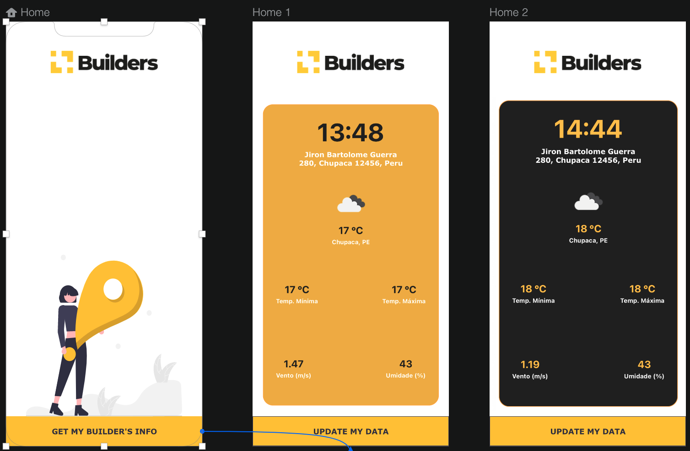

# Weather App

## 📝 Description

The goal of this app, by getting your actual geolocation, is to show your address information and also some about the weather conditions in that place.
Between 09:00am and 5:00pm the colors are bright and outsite this range the colors become darker

## 🛠️ Specifications

- 📱 **React Native** — version **0.64.0**
- 🎉 **TypeScript** - Type checking
- 📏 **ESLint** — Pluggable JavaScript linter
- 💖 **Prettier** - Opinionated Code Formatter

## 🚀 Getting started

Install node dependencies

```yarn
yarn install (or npm run install)
```

Install Dependencies for iOS

```
npx pod-install
```

**Tech**

- React Native
- Typescript

**Navigation**

- React-Navigation 5.9+

**UI**

- Styled-Components

**Store**

- Redux

**Linting and Formating**

- Eslint
- Prettier
- EditorConfig

**Others**

- react-native-gesture-handler
- react-native-safe-area-context

---

## Screens


Made by <a href="https://www.github.com/luiscamargom">Luis Camargo</a>
